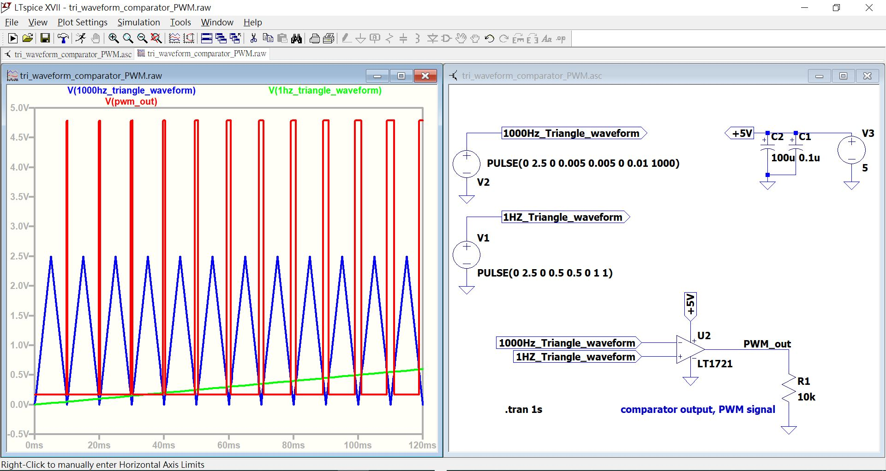
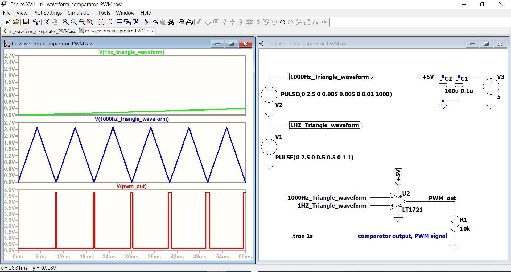
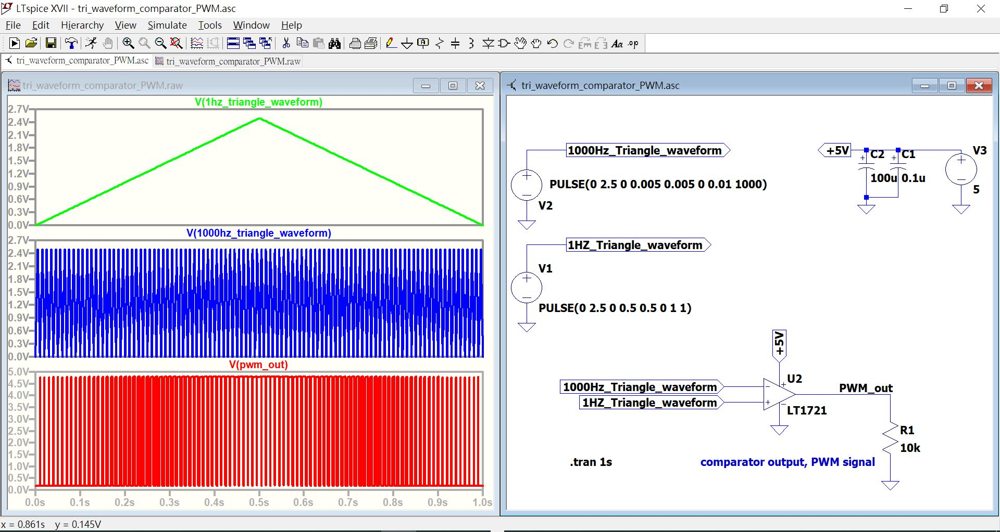

# LTspice_tri_waveform_comparator_PWM
有人說這是教科書基本PWM產生的基本功, 實際上內涵遠遠超過, 高頻三角波調製低頻訊號, 無論SIN/SQUARE/SAW或者任意波型, 都一樣, 模擬訊號數字化的其中一個方式

PWM 產生, 嘗試用成語描述的它的原理

驚鴻一瞥, 一瞥驚鴻, 例子,  
綠色線緩慢爬升, 其為驚鴻  
藍色線來回掃動, 放眼望去  
紅色線高度跟隨, 看到的驚鴻美麗的爬升立刻血壓飆到最高, 掃視時間短暫, 但是看見剎那間綠色線飛到多高, 紅色線高度就維持多久.  

驚鴻, 通常指的是美麗女子.  
瞥, 瞧一眼  
結果, 看一下記住了  
然後,,,, 趕快再來一次  

說明白了, 其是電子機器的動作也是跟隨自然定律的原理, 它一直存在, 只是你還沒有理解而已.  

 
    



  

source code  
[tri_waveform_comparator_PWM.asc](tri_waveform_comparator_PWM.asc)  

source code plain text
```
Version 4
SHEET 1 880 680
WIRE 448 -320 384 -320
WIRE 576 -320 576 -368
WIRE 576 -320 448 -320
WIRE -96 -304 -176 -304
WIRE -176 -272 -176 -304
WIRE 384 -224 384 -256
WIRE 448 -224 448 -256
WIRE 448 -224 384 -224
WIRE 384 -208 384 -224
WIRE 576 -208 576 -240
WIRE -176 -160 -176 -192
WIRE -96 -112 -176 -112
WIRE -176 -64 -176 -112
WIRE -176 48 -176 16
WIRE 336 160 336 128
WIRE 304 176 224 176
WIRE 512 192 368 192
WIRE 560 192 512 192
WIRE 304 208 224 208
WIRE 560 240 560 192
WIRE 336 256 336 224
WIRE 560 368 560 320
FLAG -176 48 0
FLAG -176 -160 0
FLAG 336 256 0
FLAG 576 -208 0
FLAG 384 -208 0
FLAG 560 368 0
FLAG -96 -304 1000Hz_Triangle_waveform
IOPIN -96 -304 Out
FLAG -96 -112 1HZ_Triangle_waveform
IOPIN -96 -112 Out
FLAG 576 -368 +5V
FLAG 336 128 +5V
FLAG 224 176 1000Hz_Triangle_waveform
IOPIN 224 176 In
FLAG 224 208 1HZ_Triangle_waveform
IOPIN 224 208 In
FLAG 512 192 PWM_out
SYMBOL Comparators\\LT1721 336 128 R0
SYMATTR InstName U2
SYMBOL voltage -176 -80 R0
WINDOW 123 0 0 Left 0
WINDOW 39 0 0 Left 0
SYMATTR InstName V1
SYMATTR Value PULSE(0 2.5 0 0.5 0.5 0 1 1)
SYMBOL voltage -176 -288 R0
WINDOW 0 24 96 Left 2
WINDOW 3 46 53 Left 2
WINDOW 123 0 0 Left 0
WINDOW 39 0 0 Left 0
SYMATTR InstName V2
SYMATTR Value PULSE(0 2.5 0 0.005 0.005 0 0.01 1000)
SYMBOL voltage 576 -336 R0
WINDOW 123 0 0 Left 0
WINDOW 39 0 0 Left 0
SYMATTR InstName V3
SYMATTR Value 5
SYMBOL polcap 432 -320 R0
WINDOW 3 24 56 Left 2
SYMATTR InstName C1
SYMATTR Value 0.1u
SYMATTR Description Capacitor
SYMATTR Type cap
SYMATTR SpiceLine V=16 Irms=0 Rser=11 Lser=0
SYMBOL polcap 368 -320 R0
WINDOW 3 24 56 Left 2
SYMATTR InstName C2
SYMATTR Value 100u
SYMATTR Description Capacitor
SYMATTR Type cap
SYMATTR SpiceLine V=16 Irms=0 Rser=11 Lser=0 mfg="AVX" pn="TAJA105K016" type="Tantalum"
SYMBOL res 544 224 R0
SYMATTR InstName R1
SYMATTR Value 10k
TEXT -88 328 Left 2 !.tran 1s
TEXT 176 328 Left 2 ;comparator output, PWM signal

```
